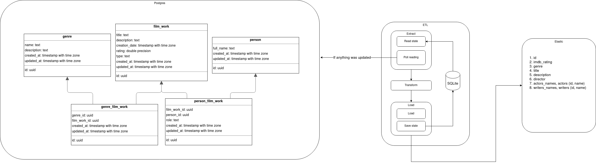

# Postgres to ElasticSearch ETL
This a learning project in Yandex Practicum Middle-Python course.  

Based on my [previous sprint work](https://github.com/andrey-lepekhin/new_admin_panel_sprint_2): Docker Compose with Nginx, uWSGI, Django admin + API, Postgres. 

## Project requirements
Details [provided in Russian](requirements.md) from the course. In short:  
Make a process to continuously load updated data from Postgres to Elasticsearch.  

* Tolerant to PG and ES downtime. Will backoff (no spamming of connection retries).
* If relaunched will start where left off, not from the beginning.
* Synchronous  

## Launching
#### First run
`make first_run`  
It takes ~15 seconds to start ES and load indexes.
* Launch docker-compose and all needed containers
* Load test movies data
* Launch ETL process

#### Subsequent runs
`make run` Starts all containers  
`make stop` Stops all containers

## ETL process diagram
 

Once every ETL_CYCLE_SEC seconds:
* Read state: last successful load (=LSL) 
* **Extract** all PG tables that have changed since LSL
  * Retry on errors
* **Transform** data for loading into ES
* **Load** data into ES
  * Retry on errors
* Save state: LSL

#### ⚠️ Assumptions
1. LSL doesn't change retroactively. E.g. LSL doesn't become equal to some time after that time has passed.    
If we want to handle this case, we'll have to use PG notifications.
2. ES index is not erased without ETL state being erased.   
If ES index is erased, ETL state needs to be reset (delete etl_state/db.sqlite file).

## Plan of attack
Here I describe my planned implementation sequence, after creating the process diagram above.

1. ✅ Connect to DB, select simple stuff
1. ✅ Connect to ES, insert simple stuff
1. ✅ Add exception handling
1. ✅ Add backoff for PG and ES
1. ✅ Create SQL query that reads all needed data that has been updated
1. ✅ Parse query results and transform to ES format
1. ✅ Bulk load transformed results to ES
1. ✅ Add state reading and saving
1. ✅ Switch to batch extracting and loading
1. ✅ Add protection to ensure only one copy of ETF process is running
1. ✅ Add logging
1. ✅ Add use of Pydantic
1. ✅ Flake8
1. ✅ Dockerize everything
1. ✅ Create makefile and readme for reviewer

### ES Postman test suite
[Here](postgres_to_es/ETLTests-2.json)
